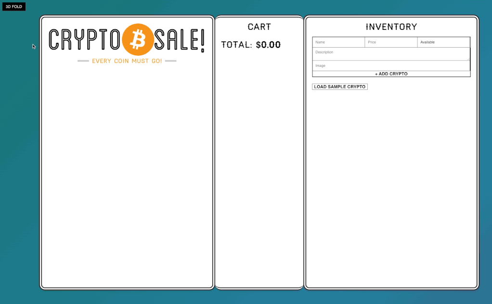

# React Crypto Sales Demo



Coding exercise using React: 

Build an all-in-one crypto broker; add crypto inventory, view available inventory and pricing, and add to cart and create orders which updates available inventory, all live-updating using React.

## Concepts Used

- create-react-app for Webpack
- React Router for Routing
- React Components (examples of both Class and Functional)
- JSX for markup
- React Hooks: useEffect, useState
- State Management
- Inventory changes live update in menu and cart
- Use LocalStorage to persist your cart
- Stylus for css preprocessor
- 3D Fold button using CSS 3D Transform and animation
- CSS animated gradient for background
- CSS animations for adding to cart

## Prerequisites
- [node >=14](https://nodejs.org/en/download)

## Install

```bash
npm install
```

## Develop

```bash
npm run dev
```

## Compile CSS

### Build CSS
```bash
npm run styles
```

### Watch CSS
```bash
npm run styles:watch
```

## Credits

Logos via [cryptocurrencyicons.org](https://cryptocurrencyicons.org/). Concepts from [WesBos' course](https://wesbos.com/courses) on React.